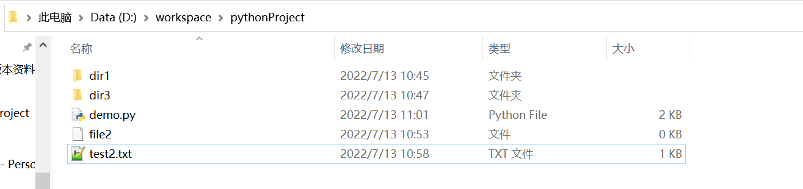

## delete

前端以form形式提交

``` 
this.$http.post('/delete',{path : this.path,file : name})
```

后端返回json格式的res.data是1表示操作成功，0表示失败

大括号中的冒号前面必须严格匹配（区分大小写），冒号后面不会检查匹配

### rename

前端以form形式提交

``` 
this.$http.post('/rename',{path : this.path,oldFileName : yourOldName,newFileName:yourNewName})
```

后端返回res.data是1表示操作成功，0表示失败

### 新建文件夹

前端以form形式提交

``` 
this.$http.post('/newdir',{path : this.path,dirName : name})
```

后端返回res.data是1表示操作成功，0表示失败

### 新建文件

前端以form形式提交

``` 
this.$http.post('/newfile',{path : this.path,fileName : name})
```

后端返回res.data是1表示操作成功，0表示失败(比如是这个文件已经存在，我后端写的是如果文件已经存在，新建同名文件会报错，如果需要返回是因为这个原因，我可以把返回值设为2表示是因为文件已经存在)

## 下载文件

前端以form形式提交

``` 
this.$http.post('/download',{path : this.path,file : name})
```

后端如果存在文件，返回文件（待确定）

否则返回0

## 上传文件

前端

``` 
<script>
export default {
methods: {
      update(e){
        let file = e.target.files[0];
        let param = new FormData(); //创建form对象
        param.append('path',this.path)
        param.append('file',file);//通过append向form对象添加数据
        console.log(param.get('file')); //FormData私有类对象，访问不到，可以通过get判断值是否传进去
        this.$axios.post('http://127.0.0.1:5000/upload',param,{headers:{'Content-Type':'application/x-www-form-urlencoded' }}, ) //请求头要为表单
          .then(response=>{
            console.log(response.data);
          })
          .catch(function (error) {
            console.log(error);
          })
      }
    }
}
</script>
————————————————
原文链接：https://blog.csdn.net/battlestar/article/details/107837362
```

后端

上传成功返回1，失败返回0

## 获取目录树

前端以form形式提交

``` 
this.$http.post('/',{path : this.path})
```

后端返回json格式的目录树


我这里的效果

``` json
[
    {
        "label": "demo.py",
        "id": "2",
        "children": []
    },
    {
        "children": [],
        "label": "dir1",
        "id": 3
    },
    {
        "children": [],
        "label": "dir3",
        "id": 4
    },
    {
        "label": "file2",
        "id": "5",
        "children": []
    },
    {
        "label": "test2.txt",
        "id": "6",
        "children": []
    }
]
```




## 刷新目录树

